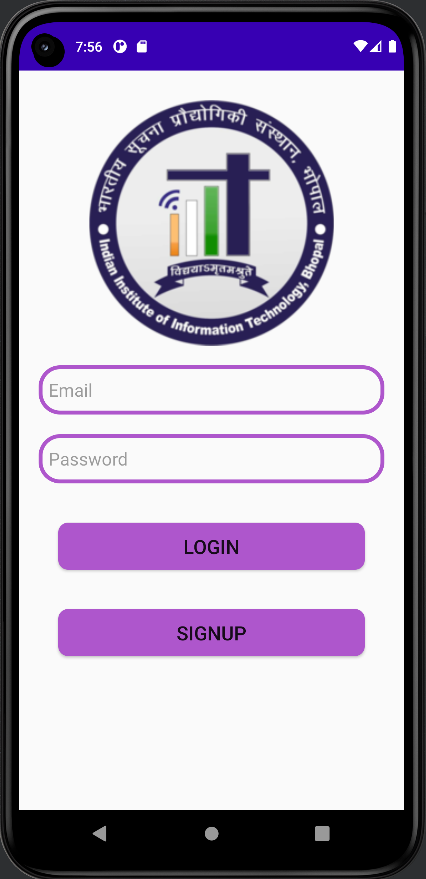
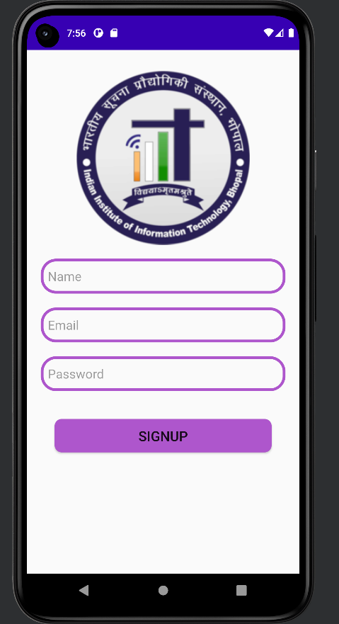
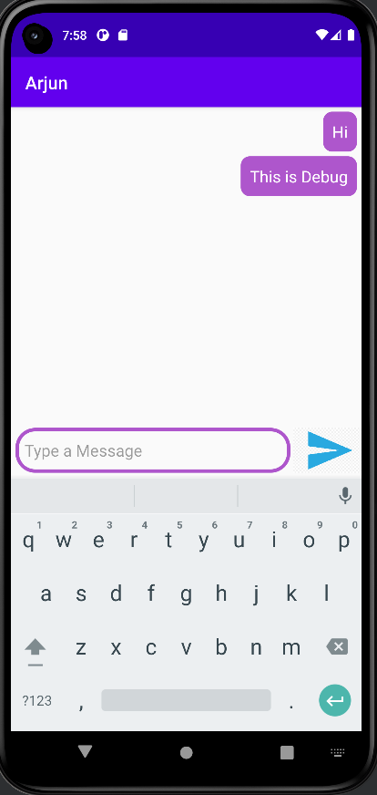
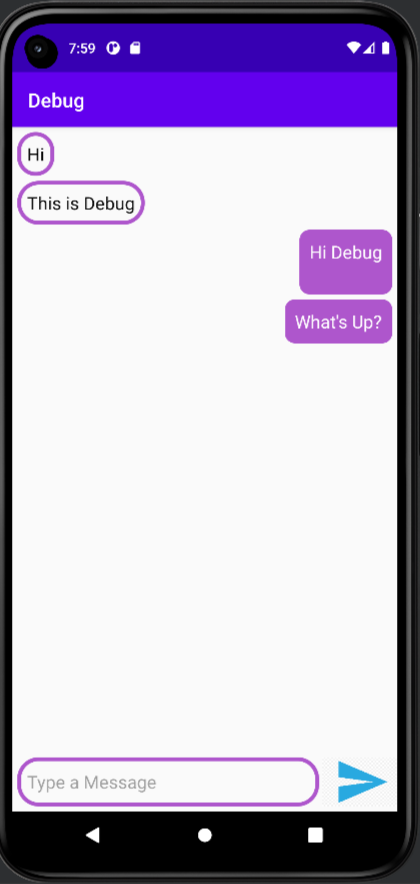

# College-Chat-Application
Created Android Chat Application using Kotlin and Firebase Real Time Database and Authentication. 

•	Implemented Email and Password Authentication and Created Nodes in Real Time Database for Users and Chats
•	Created Different Rooms for Sender and Receiver Window Using Same Adapter and Designed Great Looking User Interface. 

# ScreenShots :

  
  
  
  
